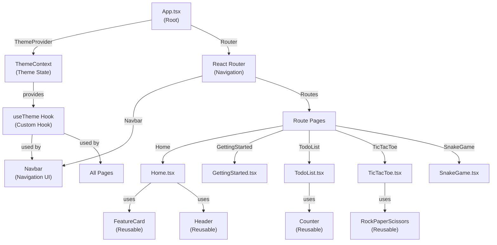
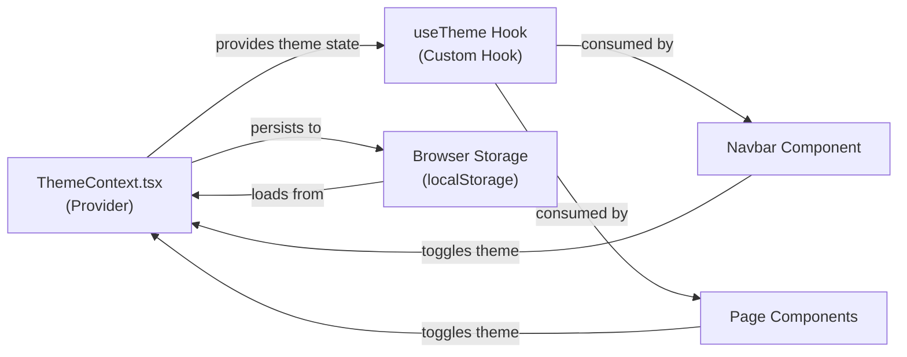

# Aine Forge Tester

A TypeScript/React application designed as a testing ground for agentic coding tools.

[](https://github.com/royceacho-wwt/aine-forge-tester/actions/workflows/ci.yml)


## 📋 Overview

This repository is set up as a foundation for testing agentic coding tools. It includes:

- **TypeScript + React 18** - Modern React with full type safety
- **Vite** - Fast development server and build tool
- **Vitest** - Unit testing framework with React Testing Library
- **ESLint** - Code linting and style enforcement
- **GitHub Actions** - CI pipeline with automated testing and deployment
- **GitHub Pages** - Automatic deployment on push to main
- **React Router** - Client-side routing for multi-page navigation
- **Theme Context** - Dark/light mode support with React Context API

## 🛠️ Getting Started

### Prerequisites

- Node.js 18+ 
- npm 9+

### Installation

```bash
# Clone the repository
git clone https://github.com/royceacho-wwt/aine-forge-tester.git
cd aine-forge-tester

# Install dependencies
npm install

# Start development server
npm run dev
```

### Available Scripts

| Command | Description |
|---------|-------------|
| `npm run dev` | Start development server |
| `npm run build` | Build for production |
| `npm run preview` | Preview production build |
| `npm run lint` | Run ESLint |
| `npm run test` | Run tests once |
| `npm run test:watch` | Run tests in watch mode |
| `npm run test:coverage` | Run tests with coverage report |

## 🏗️ Architecture

### High-Level Application Flow

```
┌─────────────────────────────────────────────────────────────┐
│                     Browser / User                          │
└────────────────────────┬────────────────────────────────────┘
                         │
                         ▼
┌─────────────────────────────────────────────────────────────┐
│                    index.html                               │
│              (Vite Entry Point)                             │
└────────────────────────┬────────────────────────────────────┘
                         │
                         ▼
┌─────────────────────────────────────────────────────────────┐
│                    main.tsx                                 │
│         (React App Initialization)                          │
└────────────────────────┬────────────────────────────────────┘
                         │
                         ▼
┌─────────────────────────────────────────────────────────────┐
│                    App.tsx                                  │
│  ┌──────────────────────────────────────────────────────┐  │
│  │  ThemeProvider (Context)                             │  │
│  │  ┌────────────────────────────────────────────────┐  │  │
│  │  │  Router (React Router)                         │  │  │
│  │  │  ┌──────────────────────────────────────────┐  │  │  │
│  │  │  │  Navbar (Navigation)                     │  │  │  │
│  │  │  ├──────────────────────────────────────────┤  │  │  │
│  │  │  │  Routes                                  │  │  │  │
│  │  │  │  ├─ Home                                 │  │  │  │
│  │  │  │  ├─ GettingStarted                       │  │  │  │
│  │  │  │  ├─ TodoList                             │  │  │  │
│  │  │  │  ├─ TicTacToe                            │  │  │  │
│  │  │  │  └─ SnakeGame                            │  │  │  │
│  │  │  ├──────────────────────────────────────────┤  │  │  │
│  │  │  │  Footer                                  │  │  │  │
│  │  │  └──────────────────────────────────────────┘  │  │  │
│  │  └────────────────────────────────────────────────┘  │  │
│  └──────────────────────────────────────────────────────┘  │
└─────────────────────────────────────────────────────────────┘
```

### Component Hierarchy



### Directory Structure

```
aine-forge-tester/
├── .github/
│   └── workflows/
│       └── ci.yml                 # CI/CD pipeline configuration
├── public/
│   └── vite.svg                   # Favicon
├── src/
│   ├── components/                # Reusable UI components
│   │   ├── Counter.tsx            # Counter component with state
│   │   ├── Counter.test.tsx       # Counter tests
│   │   ├── FeatureCard.tsx        # Feature display card
│   │   ├── FeatureCard.test.tsx   # FeatureCard tests
│   │   ├── Header.tsx             # Page header
│   │   ├── Header.test.tsx        # Header tests
│   │   ├── Navbar.tsx             # Navigation bar
│   │   ├── Navbar.css             # Navbar styles
│   │   ├── RockPaperScissors.tsx  # Game component
│   │   ├── RockPaperScissors.test.tsx
│   │   ├── *.css                  # Component styles
│   │   └── *.test.tsx             # Component tests
│   ├── pages/                     # Page components (routes)
│   │   ├── Home.tsx               # Home page
│   │   ├── Home.css
│   │   ├── GettingStarted.tsx     # Getting started guide
│   │   ├── GettingStarted.css
│   │   ├── TodoList.tsx           # Todo list page
│   │   ├── TodoList.test.tsx
│   │   ├── TodoList.css
│   │   ├── TicTacToe.tsx          # Tic-tac-toe game
│   │   ├── TicTacToe.css
│   │   ├── SnakeGame.tsx          # Snake game
│   │   └── SnakeGame.css
│   ├── utils/                     # Utility functions and context
│   │   ├── ThemeContext.tsx       # Theme provider and context
│   │   ├── ThemeContextType.ts    # Theme type definitions
│   │   ├── useTheme.ts            # Custom hook for theme
│   │   └── string.ts              # String utilities
│   ├── test/
│   │   └── setup.ts               # Test configuration
│   ├── App.tsx                    # Main application component
│   ├── App.css                    # App styles
│   ├── main.tsx                   # React entry point
│   ├── index.css                  # Global styles
│   └── vite-env.d.ts              # Vite type definitions
├── index.html                     # HTML entry point
├── package.json                   # Dependencies and scripts
├── tsconfig.json                  # TypeScript configuration
├── tsconfig.node.json             # TypeScript config for build tools
├── vite.config.ts                 # Vite configuration
├── .eslintrc.cjs                  # ESLint configuration
├── .gitignore                     # Git ignore rules
└── README.md                      # This file
```

### Data Flow: Theme Management



### State Management Pattern

```
┌─────────────────────────────────────────────────────────┐
│  Global State (React Context)                           │
│  ┌───────────────────────────────────────────────────┐  │
│  │  ThemeContext                                     │  │
│  │  - isDark: boolean                                │  │
│  │  - toggleTheme: () => void                        │  │
│  └───────────────────────────────────────────────────┘  │
└─────────────────────────────────────────────────────────┘
                         ▲
                         │
                         │ useTheme()
                         │
        ┌────────────────┼────────────────┐
        │                │                │
        ▼                ▼                ▼
    Navbar          Pages            Components
    (Reads &      (Read theme)      (Read theme)
    Toggles)
```

## 📁 Project Structure

The project follows a modular component-based architecture:

- **Components** (`src/components/`): Reusable UI components used across pages
- **Pages** (`src/pages/`): Route-based page components
- **Utils** (`src/utils/`): Shared utilities, hooks, and context providers
- **Test** (`src/test/`): Test configuration and setup

## 🧪 Testing Scenarios

This repo is designed for testing agentic coding tools. Here are some suggested scenarios:

### Beginner
- Add a new prop to an existing component
- Update styling for a component
- Add a new test case

### Intermediate
- Create a new component with state
- Implement a form with validation
- Add a new page/route
- Extend the theme system

### Advanced
- Add React Router for navigation (already implemented)
- Implement data fetching with a mock API
- Add state management (Context API or Zustand)
- Create a complete CRUD feature
- Add animations and transitions

## 🔧 Configuration

### GitHub Pages Setup

To enable GitHub Pages deployment:

1. Go to repository Settings → Pages
2. Under "Build and deployment", select "GitHub Actions"
3. The workflow will automatically deploy on push to `main`

### Environment Variables

Create a `.env` file for local development:

```env
VITE_API_URL=http://localhost:3000
```

## 🎨 Styling

The project uses CSS modules and global styles:

- **Global styles**: `src/index.css` - Base styles and CSS variables
- **Component styles**: Each component has a corresponding `.css` file
- **Theme support**: Dark/light mode via CSS variables and React Context

## 📝 Contributing

1. Create a feature branch from `main`
2. Make your changes
3. Ensure tests pass: `npm run test`
4. Ensure linting passes: `npm run lint`
5. Submit a pull request

## 📄 License

MIT
